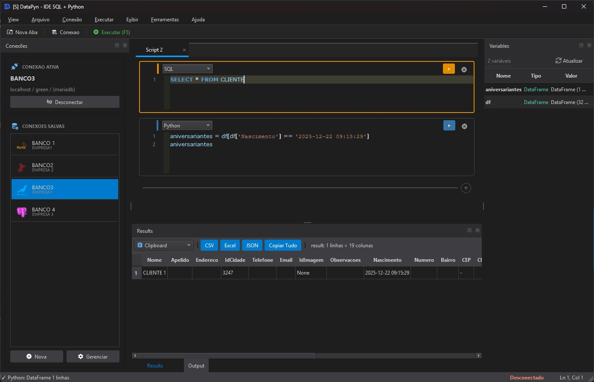

# Screenshots

Guia de screenshots para documentacao e site do DataPyn.

---

## Estrutura de Arquivos

```
docs/
+-- screenshots/
    +-- main-window.png          # Janela principal completa
    +-- editor-sql.png           # Editor com codigo SQL
    +-- editor-python.png        # Editor com codigo Python
    +-- editor-mixed.png         # Editor com blocos mistos
    +-- results-table.png        # Tabela de resultados
    +-- connection-dialog.png    # Dialogo de nova conexao
    +-- connection-panel.png     # Painel lateral de conexoes
    +-- variables-panel.png      # Painel de variaveis
    +-- output-panel.png         # Painel de output
    +-- theme-light.png          # Tema claro
    +-- theme-dark.png           # Tema escuro
    +-- graph-matplotlib.png     # Grafico gerado
    +-- export-dialog.png        # Dialogo de exportacao
    +-- settings-dialog.png      # Dialogo de configuracoes
```

---

## Screenshots Recomendados

### 1. Janela Principal (main-window.png)

**Objetivo**: Mostrar visao geral da interface.

**Conteudo sugerido**:
- Editor com codigo SQL visivel
- Tabela de resultados com dados
- Painel de conexoes visivel
- 2-3 abas abertas
- Tema claro (melhor para documentacao)

**Dimensoes**: 1920x1080 ou 1600x900

---

### 2. Editor SQL (editor-sql.png)

**Objetivo**: Destacar syntax highlighting SQL.

**Conteudo sugerido**:
```sql
SELECT 
    c.nome AS cliente,
    COUNT(p.id) AS total_pedidos,
    SUM(p.valor) AS valor_total
FROM clientes c
INNER JOIN pedidos p ON c.id = p.cliente_id
WHERE p.data >= '2024-01-01'
GROUP BY c.nome
ORDER BY valor_total DESC;
```

**Destaque**: Palavras-chave coloridas, indentacao

---

### 3. Editor Python (editor-python.png)

**Objetivo**: Mostrar codigo Python com manipulacao de dados.

**Conteudo sugerido**:
```python
# Analise dos resultados
import matplotlib.pyplot as plt

# Filtrar top 10
top_clientes = df.head(10)

# Criar grafico
plt.figure(figsize=(10, 6))
plt.barh(top_clientes['cliente'], top_clientes['valor_total'])
plt.title('Top 10 Clientes por Valor')
plt.xlabel('Valor Total (R$)')
plt.tight_layout()
plt.show()
```

---

### 4. Blocos Mistos (editor-mixed.png)

**Objetivo**: Mostrar SQL e Python no mesmo documento.

**Conteudo sugerido**:
- Bloco SQL no topo
- Separador visual entre blocos
- Bloco Python abaixo
- Indicadores de tipo de bloco visiveis

---

### 5. Tabela de Resultados (results-table.png)

**Objetivo**: Mostrar dados formatados na tabela.

**Conteudo sugerido**:
- Dados tabulares com varios tipos (texto, numero, data)
- Scroll visivel indicando mais dados
- Selecao de algumas celulas
- Barra de status com contagem de linhas

---

### 6. Dialogo de Conexao (connection-dialog.png)

**Objetivo**: Mostrar criacao de nova conexao.

**Conteudo sugerido**:
- Formulario preenchido com exemplo
- Dropdown de tipo de banco aberto (mostrando opcoes)
- Botao de teste de conexao

---

### 7. Painel de Conexoes (connection-panel.png)

**Objetivo**: Mostrar lista de conexoes salvas.

**Conteudo sugerido**:
- 3-4 conexoes com nomes descritivos
- Uma conexao selecionada/ativa
- Cores diferentes para cada conexao
- Icones de status (conectado/desconectado)

---

### 8. Painel de Variaveis (variables-panel.png)

**Objetivo**: Mostrar namespace Python.

**Conteudo sugerido**:
- `df`: DataFrame (1000 rows x 5 cols)
- `total`: 12345.67
- `resultado`: "Sucesso"
- Tipos e valores visiveis

---

### 9. Grafico (graph-matplotlib.png)

**Objetivo**: Mostrar visualizacao gerada.

**Conteudo sugerido**:
- Grafico de barras ou linha
- Titulo e labels
- Cores agradaveis
- Legenda se aplicavel

---

### 10. Temas (theme-light.png / theme-dark.png)

**Objetivo**: Mostrar ambos os temas.

**Conteudo sugerido**:
- Mesma tela em tema claro e escuro
- Util para comparacao lado a lado

---

## Especificacoes Tecnicas

### Formato

- **Formato**: PNG (preferido) ou WebP
- **Qualidade**: Maxima, sem compressao com perdas

### Dimensoes

| Tipo | Dimensao | Uso |
|------|----------|-----|
| Full screen | 1920x1080 | Hero images |
| Janela | 1200x800 | Screenshots gerais |
| Componente | 400-800px | Detalhes especificos |
| Icone | 64x64 ou 128x128 | Favicons, logos |

### Nomeacao

- Use kebab-case: `connection-dialog.png`
- Prefixo por categoria: `editor-`, `panel-`, `dialog-`
- Sufixo para tema: `-dark`, `-light`

---

## Dicas para Captura

### Windows

1. Use `Win + Shift + S` para captura de area
2. Ou `Snipping Tool` para mais opcoes
3. `Alt + Print Screen` para janela ativa

### Preparacao

1. **Limpe a interface**: Feche abas desnecessarias
2. **Use dados realistas**: Evite "teste123" ou "asdf"
3. **Maximize contraste**: Certifique-se que texto e legivel
4. **Esconda infos sensiveis**: Cuidado com hosts/senhas

### Pos-processamento

1. Recorte bordas desnecessarias
2. Adicione sombra suave se apropriado
3. Nao adicione marcas d'agua na documentacao
4. Mantenha proporcoes originais

---

## Uso no Site

### Markdown

```markdown

```

### HTML

```html

```

### Com legenda

```markdown

*Interface principal do DataPyn mostrando editor SQL e resultados*
```

---

## Checklist de Screenshots

- [ ] main-window.png
- [ ] editor-sql.png
- [ ] editor-python.png
- [ ] editor-mixed.png
- [ ] results-table.png
- [ ] connection-dialog.png
- [ ] connection-panel.png
- [ ] variables-panel.png
- [ ] output-panel.png
- [ ] theme-light.png
- [ ] theme-dark.png
- [ ] graph-matplotlib.png
- [ ] export-dialog.png
- [ ] settings-dialog.png

---

*Screenshots devem ser atualizados a cada major release para refletir a interface atual.*
